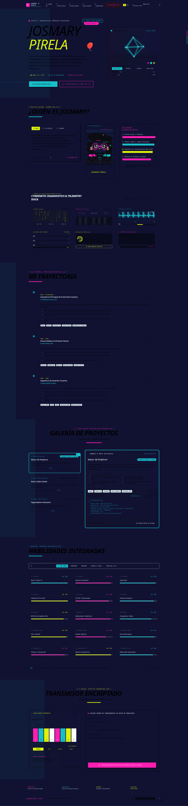

# Josmary Pirela — Portfolio

Portfolio interactivo con estética cyber-brutalist, construido para producción.

**Producción:** [josmarypirela.dev](https://josmarypirela.dev)



---

## Resumen

Este proyecto es una cartera profesional que combina:

- UI interactiva y animaciones con `motion/react`
- Renderizado estático multilingüe (`/` y `/en/`)
- Backend serverless para formulario de contacto y Open Graph dinámico
- Estrategias de accesibilidad y reducción de movimiento

---

## Features

- Bilingual SEO-ready architecture (`/` y `/en/`)
- Dynamic Open Graph generation con Edge Functions
- UI interactiva accesible
- Pipeline de contacto con rate limiting
- Soporte para reduced motion
- Lazy loading y code splitting

---

## Stack

- React 19
- TypeScript
- Vite 6
- Tailwind CSS v4
- Vercel Functions
- PostgreSQL (vía pg client, compatible con Supabase)
- Upstash Redis
- Resend

---

## Arquitectura

El proyecto está dividido en tres capas principales:

- Frontend estático (React + Vite)
- Backend serverless (Vercel Functions)
- Servicios externos (Supabase, Redis, Resend, Telegram)

Prioridades del sistema:

- SEO
- rendimiento
- accesibilidad
- modularidad
- experiencia interactiva ligera

---

## SEO

El proyecto implementa:

- renderizado estático bilingüe
- canonical URLs
- hreflang
- Open Graph dinámico
- sitemap y robots.txt

---

## Instalación local

```bash
git clone https://github.com/josmarypirela/portfolio-v2.git
cd portfolio-v2
npm install
npm run dev
```

El frontend estará disponible en `http://localhost:3000`.

Para probar funciones API:

```bash
npx vercel dev
```

---

## Configuración mínima

Copia `.env.example` a `.env` y define las variables necesarias.

```bash
cp .env.example .env
```

No almacenar credenciales en el repositorio.

---

## Scripts útiles

| Comando           | Descripción                 |
| ----------------- | --------------------------- |
| `npm run dev`     | Servidor de desarrollo Vite |
| `npm run build`   | Genera `dist/` y `dist/en/` |
| `npm run preview` | Vista previa del build      |
| `npm run lint`    | TypeScript check            |

---

## Objetivo del proyecto

Este portfolio fue construido como una exploración de:

- interfaces interactivas
- arquitectura frontend moderna
- SEO técnico avanzado
- experiencias visuales ligeras
- integración fullstack sobre infraestructura serverless

---

## Licencia

Uso personal y demostrativo.

---

## Estructura de documentación

| Documento          | Propósito                          |
| ------------------ | ---------------------------------- |
| `README.md`        | Entrada principal del proyecto     |
| `DOCUMENTACION.md` | Arquitectura y decisiones técnicas |

---

## Notas de despliegue

- Vite maneja entradas `/` y `/en/`
- OG dinámico generado en `/api/og`
- API de contacto en `/api/contact`
- Despliegue en Vercel

```

```
